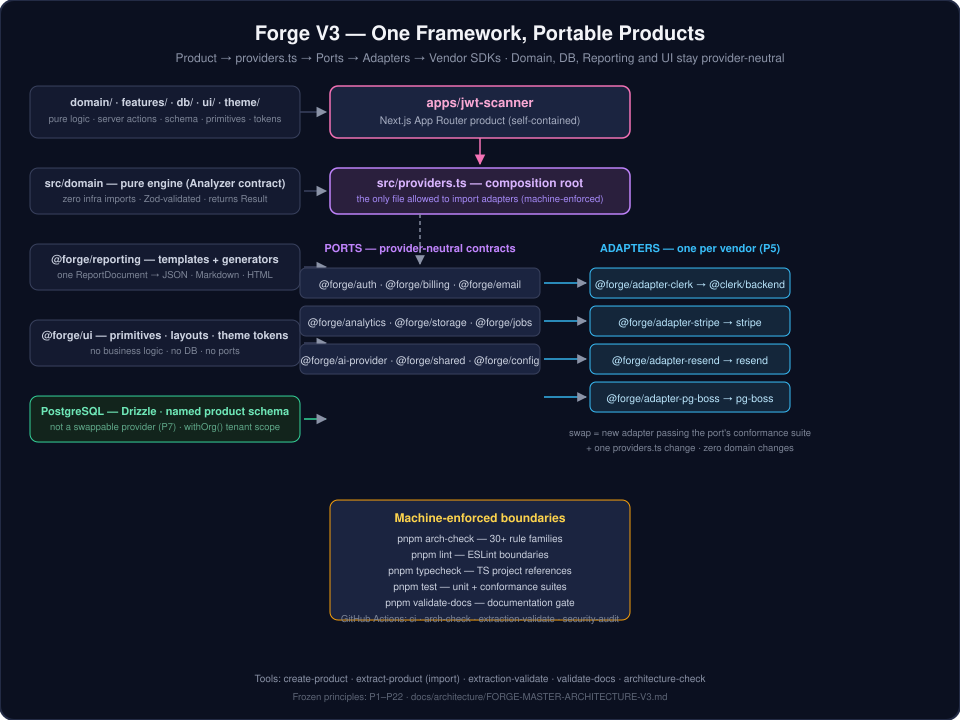

<div align="center">

# ⚒️ Forge

### The master SaaS framework for building **independent, acquisition-ready products** from one repository.

Forge is a modular-monolith framework that hosts each product as a self-contained Next.js
application behind a frozen, machine-enforced architecture — **ports, adapters, pure domain
logic, and product-scoped data** — so every product can be extracted and sold standalone
at any time.

---

**TypeScript · Next.js 15 · Drizzle ORM · PostgreSQL · Turborepo · pnpm · Vitest · GitHub Actions**

</div>

---

## What is Forge?

Forge solves a single problem: **how do you build many independent SaaS products without
maintaining many independent codebases?**

Each Forge product is a complete Next.js application — its own domain logic, its own
PostgreSQL schema, its own UI, its own documentation — yet all products share one repository,
one build system, one test harness, and one set of infrastructure contracts.

The architecture is **frozen** (22 immutable principles, `docs/architecture/FORGE-MASTER-ARCHITECTURE-V3.md`)
and **machine-enforced**: every commit is checked against the dependency graph, and violations
fail CI. Product code is written against provider-neutral **ports**; infrastructure vendors
(Clerk, Stripe, Resend, …) live behind **adapters** and can be swapped without touching
product logic.

> **Status:** Tasks 001–014 of the frozen V3 plan are implemented. Task 015 hardens the
> factory so a new product can be scaffolded, validated, and exported without rebuilding
> infrastructure. See [Current framework status](#current-framework-status).

---

## Quick start

```bash
pnpm install       # install workspace dependencies (pnpm 11.21.0 — pinned via packageManager)
pnpm build         # compile every package and product
pnpm arch-check    # enforce the frozen architecture (package + import boundaries)
pnpm validate-docs # documentation completeness gate
pnpm lint          # ESLint + boundary rules
pnpm typecheck     # strict TypeScript across the workspace
pnpm test          # 1000+ unit + conformance + integration tests
```

Run the first product locally **without any credentials or database** (deterministic test mode):

```bash
cd apps/jwt-scanner
AUTH_MODE=test BILLING_MODE=test DATA_MODE=memory pnpm dev
# → http://localhost:3000 — signed in as scanner@example.test
```

Full manual testing instructions for Windows + VS Code:
**[docs/MANUAL_TESTING.md](docs/MANUAL_TESTING.md)**

---

## Architecture at a glance

<p align="center">
  
</p>

### The data flow of every product

```
Product (apps/*)
  │  server actions + pages compose ports from providers.ts
  ▼
src/providers.ts  ── the composition root · the ONLY file allowed to import adapters
  │
  ├──► AuthPort ◄── @forge/adapter-clerk ── @clerk/backend
  ├──► BillingPort ◄── @forge/adapter-stripe ── stripe
  ├──► EmailPort ◄── @forge/adapter-resend ── resend
  ├──► JobQueuePort ◄── @forge/adapter-pg-boss ── pg-boss
  │
  └──► PostgreSQL ── Drizzle ORM (P7: the database is NOT a provider; the
       connection string is the replacement boundary)
```

In parallel, each product keeps:

- **`src/domain/`** — pure business logic. Zero imports from Next.js, React, Drizzle, vendor
  SDKs, or adapters. Inputs are Zod-validated; output is a `Result<T, E>`.
- **`src/db/`** — the product's own named PostgreSQL schema (`jwt_scanner`, …) with
  `withOrg()` tenant scoping on every query.
- **`src/features/`** — server actions that validate, authorize, call the domain engine,
  persist results, and reach external services **only through ports**.
- **`src/theme/`** — design tokens; each product defines its own visual identity.

---

## Repository map

```
forge/
├── apps/
│   └── jwt-scanner/          # Product 1 — analyzer archetype (Task 013)
│       ├── src/
│       │   ├── app/          #   Next.js App Router (landing, dashboard, webhook, export)
│       │   ├── domain/       #   pure JWT analysis engine (none_alg, weak_hmac, …)
│       │   ├── features/     #   server actions + services (scans, billing, auth)
│       │   ├── db/           #   jwt_scanner schema + migrations
│       │   ├── dev-mode/     #   deterministic test-mode port seams (AUTH_MODE=test, …)
│       │   └── providers.ts  #   composition root — the only adapter-importing file
│       ├── docs/             # 10 required product documents
│       ├── e2e/              # Playwright critical path
│       └── product.manifest.ts  # archetype, capabilities, plans
│
├── packages/
│   ├── shared/               # Result, AppError, pagination — the kernel
│   ├── config/               # ProductManifest, env schemas
│   ├── domain/               # archetype contracts + shared primitives (Severity, …)
│   ├── db/                   # Drizzle client factory, platform schema, withOrg()
│   ├── ui/                   # React primitives, layouts, theme tokens
│   ├── auth/  billing/  email/  analytics/  storage/  jobs/  ai-provider/
│   │                         # PORT packages — provider-neutral interfaces only
│   ├── reporting/            # ReportTemplate + JSON/Markdown/HTML generators
│   ├── testing/              # conformance suites, factories, mock adapters
│   └── adapters/
│       ├── clerk/            # Clerk → AuthPort
│       ├── stripe/           # Stripe → BillingPort
│       ├── resend/           # Resend → EmailPort
│       └── pg-boss/          # pg-boss → JobQueuePort (default, PostgreSQL-backed)
│
├── tools/
│   ├── architecture-check/   # pnpm arch-check — full repository gate
│   ├── create-product/       # scaffold a new product (all 6 archetypes)
│   ├── extract-product/      # import an existing app into Forge structure (see below)
│   ├── extraction-validate/  # validate product extraction readiness
│   └── validate-docs/        # documentation completeness gate
│
├── docs/
│   ├── FRAMEWORK.md          # framework overview
│   ├── ARCHETYPES.md         # the 6 product archetypes
│   ├── MANUAL_TESTING.md     # Windows/VS Code manual testing guide
│   ├── assets/               # diagrams
│   └── architecture/         # FORGE-MASTER-ARCHITECTURE-V3.md (the frozen spec)
│
├── .ai/                      # AI governance — rules, boundaries, patterns, task contract
└── .github/workflows/        # ci · arch-check · extraction-validate · security-audit
```

### Layer rules (machine-enforced)

| Layer | May import | Never imports |
|---|---|---|
| `apps/*/src/domain/**` | Zod, `@forge/shared`, `@forge/domain`, local types, Node stdlib | `next`, `react`, `@forge/db`, ports, adapters, vendor SDKs |
| `apps/*/src/**` (other) | ports, `@forge/db`, `@forge/ui`, `@forge/reporting` | `packages/adapters/*` — except `src/providers.ts` |
| `packages/[port]` | `@forge/shared` | adapters, vendor SDKs |
| `packages/adapters/[x]` | its port, `@forge/shared`, its vendor SDK | other ports, other adapters |
| `packages/db` | `@forge/shared`, drizzle-orm, postgres.js | domain, adapters |
| `packages/ui` | react, react-dom | domain, db, ports, adapters |
| `packages/testing` | all ports, `@forge/shared`, vitest | adapters |
| any `packages/*` | — | `apps/*` |

---

## Ports & adapters: how provider-neutrality actually works

A **port** (`packages/auth`, `packages/billing`, …) is a TypeScript interface describing what a
capability must do — nothing more. An **adapter** (`packages/adapters/clerk`, …) implements that
interface for one concrete vendor. The vendor SDK appears **only inside its adapter package**
(frozen principle P5) and is imported **only by `apps/*/src/providers.ts`**.

```ts
// apps/jwt-scanner/src/providers.ts — the composition root
import { clerkAuthAdapter, createClerkBackendClient, createClerkTokenVerifier } from "@forge/adapter-clerk";
import { stripeBillingAdapter, stripeBillingWebhookHandler } from "@forge/adapter-stripe";

export const authPort = buildAuthPort(authMode);     // AuthPort
export const billingPort = buildBillingPort(billingMode); // BillingPort
```

Product code never sees a vendor type:

```ts
// apps/jwt-scanner/src/features/scans/service.ts
import type { AuthPort } from "@forge/auth";          // the port, not the vendor
import { getOrgUserContext } from "@/features/auth/session";

const context = await getOrgUserContext(deps.auth);   // authPort injected
```

### Provider swap = 3 steps, zero product changes

1. **Implement** a new adapter that satisfies the port's **conformance suite**
   (`packages/testing/conformance/` — a passing adapter is a *valid replacement* by definition).
2. **Wire** it in `apps/jwt-scanner/src/providers.ts` (and the env variables it reads).
3. **Verify** with `pnpm arch-check` (vendor leakage / adapter bypass rules) and `pnpm test`.

Domain logic, feature services, database schema, report templates, and UI never change.
Today's implemented adapters prove the claim: `clerk` (AuthPort), `stripe` (BillingPort),
`resend` (EmailPort), `pg-boss` (JobQueuePort). Every one passes its port's conformance suite.

> **Honest boundary:** PostgreSQL is **not** a provider. `Application → Drizzle → PostgreSQL`
> is fixed (P7); the `DATABASE_URL` connection string is the replacement boundary. There is
> deliberately no `IDatabaseAdapter`.

---

## Architecture enforcement

Four independent mechanisms make the frozen architecture a *mechanical* property of the
repository, not a convention:

| Gate | Command | Catches |
|---|---|---|
| **arch-check** | `pnpm arch-check` | vendor leakage, adapter bypass, adapter→adapter, port→adapter, domain→infrastructure, cross-product imports, package→app, reporting/UI/testing neutrality, DB boundary, unscoped tenant queries, missing `product_id`, workspace/dependency-direction violations, circular package deps, manifest/placement errors |
| **ESLint** | `pnpm lint` | boundary violations and code-quality rules across every package |
| **TypeScript** | `pnpm typecheck` | strict-mode type errors, unresolved internal imports |
| **Documentation** | `pnpm validate-docs` | missing/stub framework and product documents (P14) |

CI runs all gates on every push/PR plus a **dependency security audit**
(`pnpm audit --audit-level=high` — high/critical blocks merge, V3 §13.2) and a monthly
**extraction validation** run. The pre-commit hook runs `pnpm arch-check` locally.

---

## Testing & conformance model

- **Unit tests** — pure domain logic (`src/domain/__tests__`), shared primitives, and
  feature services, run with Vitest.
- **Conformance suites** — `packages/testing/conformance/` defines the exact contract of every
  port. Any adapter that passes the suite is a valid replacement (P12).
- **Neutrality tests** — every port, adapter, and layer package pins its own import surface
  (`*__tests__/neutrality.test.ts`), so boundary violations are caught at the package level too.
- **Integration tests** — `apps/jwt-scanner/src/__tests__/integration/` exercises the real
  service layer (auth port → engine → persistence → reporting) with the canonical
  `@forge/testing` mocks and in-memory persistence.
- **E2E** — Playwright critical path (signup → scan → findings → export) runs the real app in
  deterministic test mode (`AUTH_MODE=test BILLING_MODE=test DATA_MODE=memory`).
- **Coverage** is a quality *signal*, not a gate (P22).

Current suite: **24 packages, 44 test tasks, 1000+ tests, all green** on a clean checkout
(`pnpm test`).

---

## Reporting & UI architecture

**Reporting** (`@forge/reporting`, capability `reporting`) is archetype-dependent and optional
(P17). A product implements the `ReportTemplate` contract — turning persisted data into a
format-neutral `ReportDocument` — and the shared pipeline renders it as **JSON, Markdown, or
HTML**. The JWT Scanner report template is deterministic: identical persisted data always
produces byte-identical output.

**UI** (`@forge/ui`) provides structural primitives (Button, Card, Table, Dialog, badges,
layouts, chart containers) plus the **theme token system** (P13). Products define their visual
identity with tokens (`src/theme/tokens.ts` → CSS custom properties); the UI package never
hard-codes a product's colors, imports business logic, or queries the database.

---

## Product creation

```bash
pnpm create-product my-analyzer --archetype analyzer --capabilities reporting
```

Scaffolds a complete, valid product skeleton at `apps/my-analyzer/`:
Next.js app (product-owned landing + workspace, not JWT Scanner), `domain/engine.ts`
implementing the archetype contract, Zod schemas, Drizzle schema, test-mode
`providers.ts`, theme tokens starting from the framework baseline, Docker files,
the 10 required docs, and a Playwright smoke test. The skeleton passes
`pnpm arch-check` and runs locally with `AUTH_MODE=test BILLING_MODE=test DATA_MODE=memory`.

**Product archetypes** (6): `analyzer` · `optimizer` · `generator` · `transformer` ·
`middleware` (runtime) · `gateway`. Each maps to an engine contract in `@forge/domain`
(`docs/ARCHETYPES.md`). The first product, **JWT Scanner**, validates the analyzer archetype
end-to-end; a second archetype (generator) is planned to confirm the framework is not coupled
to analyzer patterns (V3 §20.2).

## Product extraction

Frozen principle P15: *every product must survive extraction at any time*. The repository
enforces extraction readiness in three ways:

- **`pnpm extract-product <source> <destination>`** — imports an existing application into the
  Forge V3 product structure with deterministic classification of every file and dependency
  (`SAFE` / `REVIEW` / `MANUAL`), provider isolation into a generated `providers.ts`, and a
  machine-readable extraction report.
- **`pnpm extract-product --export <id> <dest>`** — exports one Forge product as a standalone
  workspace (that product only, the `@forge/*` packages it uses, and the architecture/docs
  gates). Other products, factory CLIs, `node_modules`, and secrets are not copied.
- **`pnpm extraction-validate [product]`** — validates one product, or every product under
  `apps/` when the name is omitted, against the frozen structure, manifest, documentation,
  and provider-isolation rules (delegating to `arch-check` + `validate-docs`). No product id
  is hardcoded. Live credentials and a product-scoped `pg_dump` remain operational handoff
  steps (see the product's `docs/ACQUISITION.md`).

---

## Development workflow

```bash
# 1. Install & build once (or after pulling)
pnpm install && pnpm build

# 2. Iterate on a product (no credentials needed)
cd apps/jwt-scanner
AUTH_MODE=test BILLING_MODE=test DATA_MODE=memory pnpm dev

# 3. Validate before committing
pnpm lint && pnpm typecheck && pnpm test && pnpm arch-check && pnpm validate-docs
```

The pre-commit hook (`pnpm arch-check`) runs automatically. Git hooks are configured by
`pnpm install` (`prepare` script → `pnpm setup-hooks`).

## Validation commands

| Command | Purpose |
|---|---|
| `pnpm install` | workspace install (pnpm 11.21.0 via `packageManager`) |
| `pnpm build` | compile all packages + products |
| `pnpm arch-check` | frozen architecture enforcement |
| `pnpm validate-docs` | documentation gate |
| `pnpm lint` | ESLint + boundary rules |
| `pnpm typecheck` | strict TypeScript |
| `pnpm test` | full unit + conformance + integration suite |
| `pnpm audit` (or `pnpm audit --audit-level=high`) | dependency vulnerability scan |
| `pnpm validate` | architecture + docs + lint + typecheck + test |
| `pnpm create-product …` | scaffold a runnable product under `apps/` |
| `pnpm extract-product <src> <dest>` | import an existing app into Forge structure |
| `pnpm extract-product --export <id> <dest>` | export a Forge product as a standalone workspace |
| `pnpm extraction-validate [product]` | validate one product, or every product under `apps/` |

## Manual testing reference

The complete, step-by-step manual test guide for **Windows + VS Code** — prerequisites,
database setup, migrations, running the app, auth/tenant setup, the full product workflow,
provider swap demonstration, all validation commands, a 20-row test matrix, and
troubleshooting — lives in **[docs/MANUAL_TESTING.md](docs/MANUAL_TESTING.md)**.

---

## Current framework status

| Area | Status |
|---|---|
| Framework packages (shared, config, domain, db, ui, reporting, testing) | ✅ implemented & tested |
| Port packages (auth, billing, email, analytics, storage, jobs, ai-provider) | ✅ implemented & tested |
| Adapters (clerk, stripe, resend, pg-boss) | ✅ implemented, conformance-tested |
| Tooling (architecture-check, create-product, extract-product export, extraction-validate, validate-docs) | ✅ implemented & tested |
| CI/CD (ci, arch-check, extraction-validate, audit) | ✅ implemented |
| First product (JWT Scanner, analyzer) | ✅ implemented (Task 013), integrated & smoke-tested (Task 014) |
| Factory readiness (create Product #3 without rebuilding infrastructure) | ✅ Task 015 |
| Dependency security | ✅ `pnpm audit --audit-level=high` in CI |
| Framework documentation + manual testing guide | ✅ Task 014 / 015 |
| Browser E2E / live-provider / real-Postgres verification | ⏳ manual — see `docs/MANUAL_TESTING.md` |

## License

Proprietary — all rights reserved.
